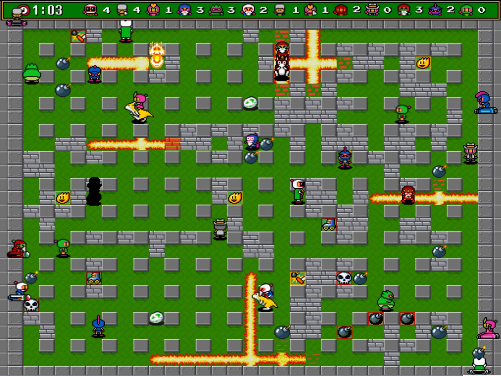

## Super Mario Bros

You take on the role of Italian-American plumber Mario.
Your goal is to save Princess Toadstool, while racing through the Mushroom Kingdom and surviving the main antagonist Bowser's forces.

You move from the left side of the screen to the right side in order to reach the flagpole at the end of each level.

There are coins scattered around for Mario to collect, and special bricks marked with a question mark, which when hit by Mario, may reveal more coins or a special item. Other secret (often invisible) bricks may contain more coins or rare items that give Mario special powers.
Mario's primary attack is jumping on top of enemies.

## Lemmings

Your goal is to guide the highest percentage of lemmings from the entrance to the exit by clearing or creating a safe route through the landscape.

Unless assigned a special task, each lemming will walk in one direction ignoring any other lemming in its way (except blockers), falling off any edges and turning around if they hit an obstacle.

A lemming can die in a number of ways: falling from a great height, falling into water or lava, disappearing off the top or bottom of the screens, being caught in a trap, being assigned the bomber skill. There are eight skills that can be assigned: climber, floater, bomber, blocker, builder, basher, miner, digger.
## Bomberman

Your goal is to complete maze-like levels by strategically placing bombs in order to kill enemies and destroy obstacles. Exploding bombs can set off other bombs, kill or injure enemies and destroy obstacles. However, they can also kill or injure your character or destroy powerups.

Bomberman games also feature a multiplayer mode, where other Bombermen act as opponents, and the last one standing is the winner.
## Frogger

Your goal is to guide a frog from the bottom of the screen to one of the frog houses on the top, avoiding various obstacles (vehicles, logs, crocodiles, turtles) on your way.

You can only push the frog left or right, causing it to hop once in that direction. You die if the frog hits any obstacles.

## Pac-Man

You control Pac-Man through a maze, eating dots. Your goal is to eat them all, whilst avoiding the four ghost enemies. If an enemy touches Pac-Man, a life is lost. 

Near the corners of the maze are four larger, flashing dots known as power-pellets that provide Pac-Man with the temporary ability to eat the enemies: they turn deep blue, reverse direction and move more slowly. When an enemy is eaten, it returns to the centre box where it is regenerated in its normal colour.

## Space Invaders

You control a laser cannon by moving it horizontally across the bottom of the screen and firing at descending aliens. Your goal is to defeat five rows of eleven aliens that move horizontally back and forth across the screen as they advance towards the bottom of the screen shooting at the player. 

A special mystery ship will occasionally move across the top of the screen and award bonus points if destroyed.

Your cannon is partially protected by fixed defence bunkers, which are gradually destroyed by your fire, or the enemy's.