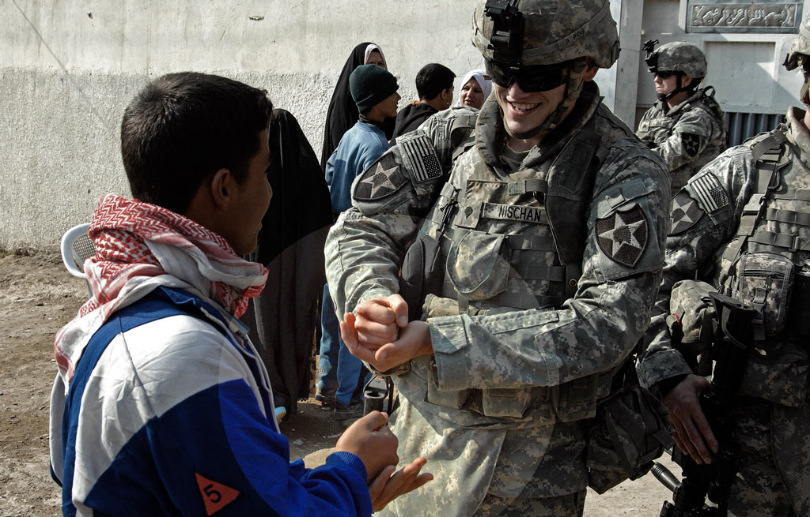
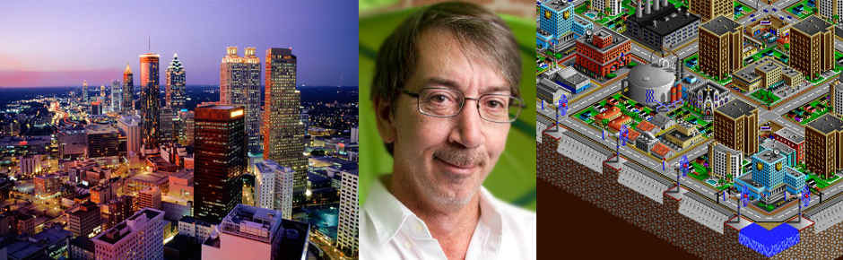
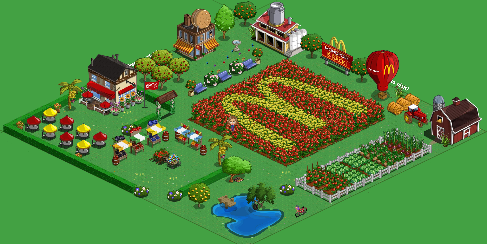
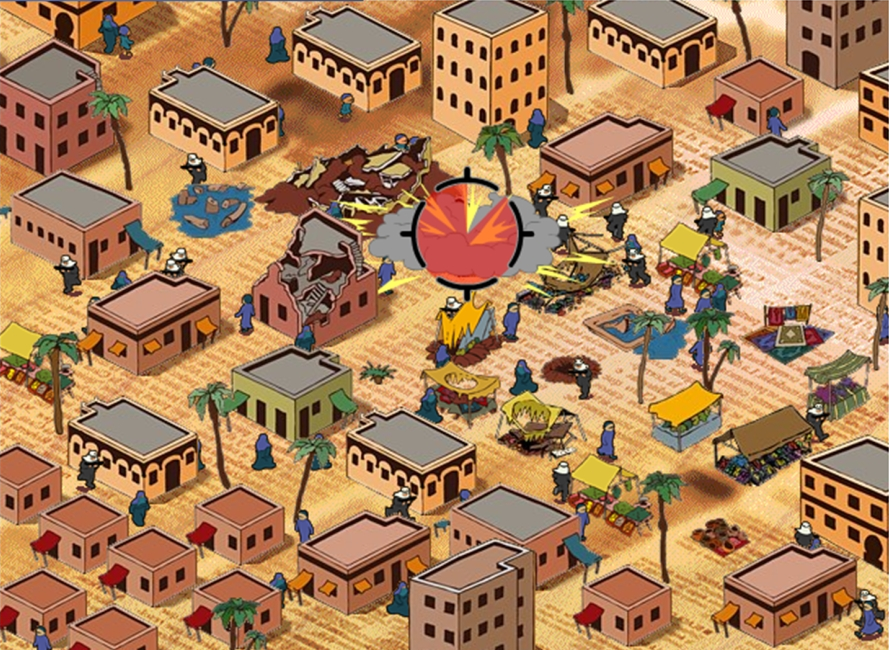
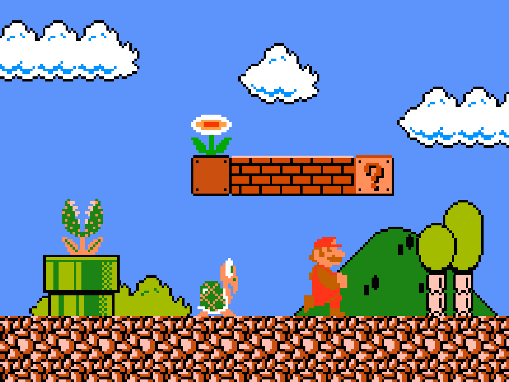
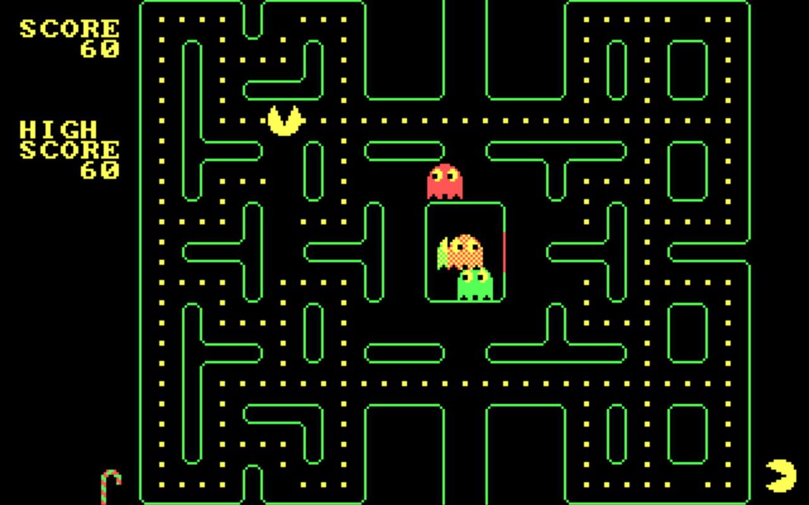

# Hacking games with verbs

## Warnings!

### No experience? No problem.

You won't need any experience in game design or *coding* in this workshop: I will assume **zero knowledge**. 

In fact, you're probably more experienced *gamers* than myself.

### What the hack?

This workshop is about **prototyping games** with a hacker's mindset.

In that spirit, I decided to *hack the workshop* itself and turn it on its head, so this will be quite experimental :)

#### `stories ⟵?⟶ games`

Imagine we're exploring the *territory* between stories and games.

So far you have developed **storylines** (or story-maps), and then cut those up into playable blocks with [Twine](http://twinery.org/). In other words, you started from linear stories and moved a bit into the unchartered territory towards games, by making (more or less) interactive stories. 

Today we're starting from the opposite end, and move towards the middle.

### Verbs?

> Ever tried to talk to a monster in a first-person-shooter, instead of shooting it? 

Whether it is running or collecting, shooting or trading, **games are driven by verbs**: they determine what you can do in a game, how you can interact with its characters or other players, what you should do to win it, and what you simply can't do. 

#### Think of a game you've played recently. 

* What actions does the game allow you to do? 
* And what does the game not let you do?

This session is about **hacking games**, using a tool we are all familiar with: verbs! We're all familiar with verbs, right? 

### Hacking? 

What does hacking mean to you? 

What does hacking mean [according to Google](https://www.google.co.uk/search?q=hacking&source=lnms&tbm=isch&sa=X&ei=CZguVeynIIOqafWlgLAK&ved=0CAcQ_AUoAQ&biw=1379&bih=782#q=hacking&tbas=0&tbm=isch&tbs=isz:l)?

Why does hacking have such **negative** connotation? 

Can we look at hacking as a **neutral**, or even **positive** practice? As in 

> modifying something, possibly to improve it

#### Hacking a game

What happens when you hack a game?

Let's hack [rock-paper-scissors](http://en.wikipedia.org/wiki/Rock-paper-scissors)

* What if you **remove** one element? 
* What if you **add** one element?
* How about changing the number of **players**? 
* What if you introduce new **rules**? 
* Who says you can only use your hands? What about the rest of the body?
* Who says you can only use visual signs? How about noises, or smells?

* What do you **know** about the other player's strategy?
* Is there a **strategy** to win this game?
* What if you change the **goal** of the game?
* How about turning it into a **collaborative** game? 

* How about **renaming** the elements? 
* Can you think of a different **story** (narrative) for this game?
* What **messages** may the gameplay communicate?

<!-- 

Abstracting: A beats B, B beats C, and C beats A
 
Japanese mushi-ken: frog, slug & snake
Kitsune-ken: fox, mayor, hunter
Malaysia: bird, water, stone

Balance:
As long as the number of moves is an odd number and that each move defeats exactly half of the other moves while being defeated by the other half, any combination of moves will function as a game. 
 
Psychology? 
attack and defence
chance or pattern recognition?

simultaneous decision game

zero-sum game: wins for the winner are equal to the losses for the loser

-->

### Today

Today we will:

1. Look at classic videogames in terms of verbs and explore how these verbs express **messages** and **morals**, **ideas** and **ideologies**. 
2. Hack these games, changing the verbs so that they expresses our **views**, communicates our **ideas** or raises **awareness** about something we **care** about.

# Are games mindless entertainment?

Can games can convey **messages**? 

Can they they embody certain **values**? Even when they are not designed for that?

# Who makes games?

Between a real city and [SimCity](http://en.wikipedia.org/wiki/SimCity) there is a person who decides what to include and what to not include in the **simulation**, how the game elements interact, what you (as a player) can do and what you cannot do.

Games are **cultural products made by actual people** (typically white male nerds).

People with their own background, culture, systems of values, beliefs. 

These backgrounds will inevitably affect the design of the game.

As a designer you can take **responsibility** for these decisions, and think about the messages that your game communicates.

# Do games simulate real life?

A simulation is an **abstraction** of real life, which necessarily eliminates some of real life's complexities to focus on certain aspects only. 

Like a **scientific experiment**, a simulation game creates a **simplified model of real life**, which variables can be manipulated by a scientist, or a player. Who designs the experiment, or the game, decides which variables to include and which to leave out.

Do you find **racial tensions** in SimCity? 

What about the American cities on which it was modelled?

Who are the goodies? 

And who are the baddies?

In **military themed** first-person shooters you generally get a fantastical, propagandistic representation of war, reflecting a simplified vision of the world divided into goodies and baddies, where enemies are clearly distinguishable, dressed up with balaclavas, and civilians are nowhere to be seen.

# Farmville simulates real farms

Agree or disagree?

**What** system does [Farmville](http://en.wikipedia.org/wiki/FarmVille) simulate?

**How** does it simulate business processes? 

Endless accumulation, endless expansion. But is that how things work in real life? 

Can you exclude the byproducts of industrial food production: pollution, deforestation, worsening labour conditions? 

> Even Farmville, where you don’t kill anyone, can carry a problematic message.

Agree or disagree?

On the other hand there's [McVideoGame](http://www.mcvideogame.com/index-eng.html), which simulates how the fast food giant operates:

* Your goal is to make money and avoid bankruptcy. 
* During the game you choose whether or not to feed the cows genetically altered grain, or plough over rainforests, or feed the cows to other cows. 
* You can also choose advertising strategies and public official corruption to counteract opponents of your actions.

<!-- Games can help us tell the story of a dysfunctional food system, understand the roots of a rich-getting-richer class dynamic, and many other issues that seem to have way too many moving parts to be reduced to personal stories or linear cause-and-effect relationships. -->

> By playing and making games we can take a step out of the **systems** we inhabit, conceptualise them as a whole, identify the **conflicting forces** in play, and envision better systems.

Agree or disagree?

Here's an example: [Eco by StrageLoopGames](http://www.strangeloopgames.com)

# Games are simply interactive narratives

Agree or disagree?

Nowadays a lot of games rely heavily on **stories**.

Can you think of a game without a story?

Would you still play Mario if the princess wasn't there?

Have you heard of the **damsel in distress**?

Lots of games use cliched narrative tricks for **character development**, and propose questionable representations, embracing and reinforcing the dominant systems of values, also known as **ideology**.

How are genders *represented* in games?

How are minorities *represented* in games?

Women and minorities are rarely featured, and we can spot that quite easily. But we need **literacy** for the more subtle implications, not just whether or not you can play as a black girl, but how is the experience of playing in this role.

Take [The Sims](http://en.wikipedia.org/wiki/The_Sims), which allows all sort of skin colours and some gender orientation outside the binary norm. Yet these differences are irrelevant to the gameplay, as the system of the game doesn't really take them into account: you have the same career and friendship opportunities regardless of your identity. 

Your ethnic background is flattened to a single, insignificant variable.

# What makes games different than linear media?

> If I throw a ball at you, I don’t expect you to drop it and wait until it starts telling stories.

[Markku Eskelinen](http://www.gamestudies.org/0101/eskelinen/)

Linear media (such as films and novels) typically create meaning through storytelling. 

# How do games create meaning?
 
* **Rule** system
* **Resources** that are controlled by these rules (audiovisual assets in videogames)
* How **players interact** with these rules

Games (not just videogames) are primarily **systems of rules**.

In game design, the dynamic relationship between rules and players is called **gameplay**.

In this workshop we will break down gameplays as verbs (because we are familiar with verbs) and then envision different forms of gameplays: **expressive gameplays**.

# What roles do you play? 

Another important property of games, setting them apart from storytelling media, is **roleplay**.

You don't just empathise with a character, you **immerse** yourself in that character and **take decisions** for her in the simulated world.

Most mainstream games use roleplay in function of **escapism**, and they tend to be *power fantasies*.

Can we challenge players to experience the world from a different perspective? 

A disempowered perspective?

There are some experiments, like [Darfur is dying](http://www.darfurisdying.com) in which you play as a Darfur refugee, or [Spent](http://playspent.org), a simulation of daily life below the poverty line.

Awkward roleplay strategies can be used to create **moral dilemmas**, forcing the player into disempowered, embarrassing, unusual roles. 

Reversing the tendency of mainstream games to function as power fantasies in order to push the player to reflect on power relations that exist in the real world.

<!--

### PAPER-PROTOTYPING

This is a workshop about videogames, but it is not our aim to build a videogame in one hour and a half.

We are used to considering videogames as technological objects, but before becoming software they have to be designed as rule systems.

You can actually design videogames without computers. That's what videogames designers and developers often do at the very beginning of the process: **sketching, visualising, moving pieces of paper around**.

### Why remixing?

-->

# Your turn

We are going to hack **existing** videogames, just to take out some of the variables and focus on the **mechanics** of the games, rather than producing visuals and thinking about characters and stories.

We are going to use **classic videogames** for a few good reasons:

* they tend to be more broadly known than contemporary ones
* they are simpler, so if you never played them you can figure them out in few seconds
* they are to some extent *archetypes*, in that they introduced some of the most basic elements that are still present in contemporary videogames (graphics and AI aside modern FPS are still based on shooting and dodging, like [Space Invaders](http://en.wikipedia.org/wiki/Space_Invaders)). 

### 1. Picking out the verbs

We will give each team one game.

Break down the game mechanics into **verbs** and think about the implicit or explicit **messages** that they communicate:
    
* What **verbs** are used in the game?
* Can you think of any other relevant verbs that **could have been included** in the game?
* What **messages** does the game communicate? 
* What **morals** does it embody?

### 2. Hacking the game

We will give each team an **issue**.

**Redesign the game so that it is about the issue**: do this by using a different set of verbs that reflect the values and views of your group.

Verbs will be the building blocks of your new game, but consider also how you can change the **gameplay** (its system of rules and the way players interact with characters and objects), the game **goal** and its **narrative**.

Your finished game may look similar but will play very differently than the original! 

### Examples

#### Mario + food politics

Mario sets on a mission to collect and bring food to a hungry neighbourhood, whilst fighting Bowser, who controls a monopoly of restaurants and sends out Goombas to destroy the food.

#### Pac-Man + bullying  

Pac-Man is a student, bullied by ghosts. Some of them pick on his skin colour, others on his insatiable hunger. In order to defeat the different types of bullies, you needed different skills (fruits)

#### Space Invaders + international affairs

Space Invaders turns into a multiplayer game, using a Lemmings-like guidance mechanic to infiltrate the G20 meeting. You can play cooperatively or competitively.

#### Mario + economy

Princess Toadstool is in debt, and Mario has to bail her out. The more time passes, the bigger her debt grows.
So you set out to gather money and keep up with repayments, while the game keeps throwing moral dilemmas at you: mug people or burgle houses for quick bucks, or go the slower legitimate way of earning money with hard work? This idea sparkled from the thought that actions in the original Mario have no consequences, you keep jumping over turtles and breaking bricks, collecting coins that can't be traded.

#### Bomberman + digital literacy

You have Internet connection, but your friends don't. Your first goal is to get them connected, so that you can start building things together. So you set out to find cable and build a physical network, but the network thieves drop bombs to destroy your connections. When you connect another player, they can help you make the network stronger and unlock new challenges to build the Open Web.

#### Pac-man + energy

You (Pac-man) want to be energy efficient, but energy corporations want you to waste it. Your goal is to get out of each level's maze by consuming the least amount of energy (dots), while the shiny gadgets and juicy appliances that are thrown at you to increase your bill. This game subverts the Pac-man gameplay by turning its endless hunger and pointless accumulation into a strategic avoidance.

<!--

Games suggested by students

http://www.funny-games.biz/breeder.html
http://tangerinetycoon.com/

-->