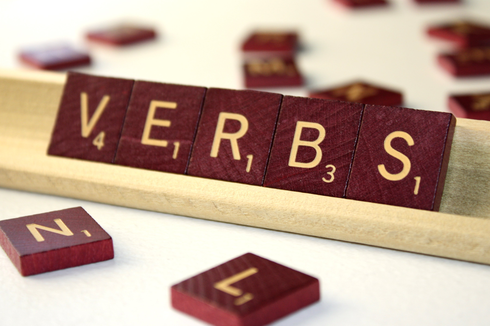
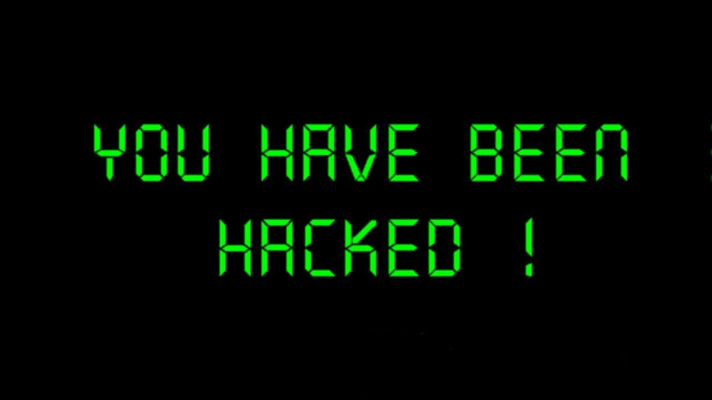
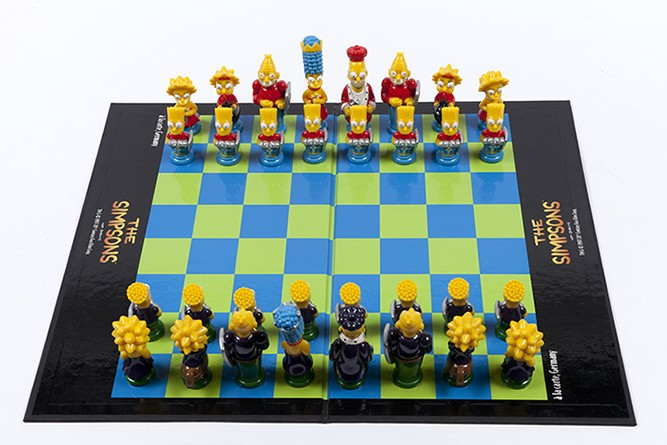
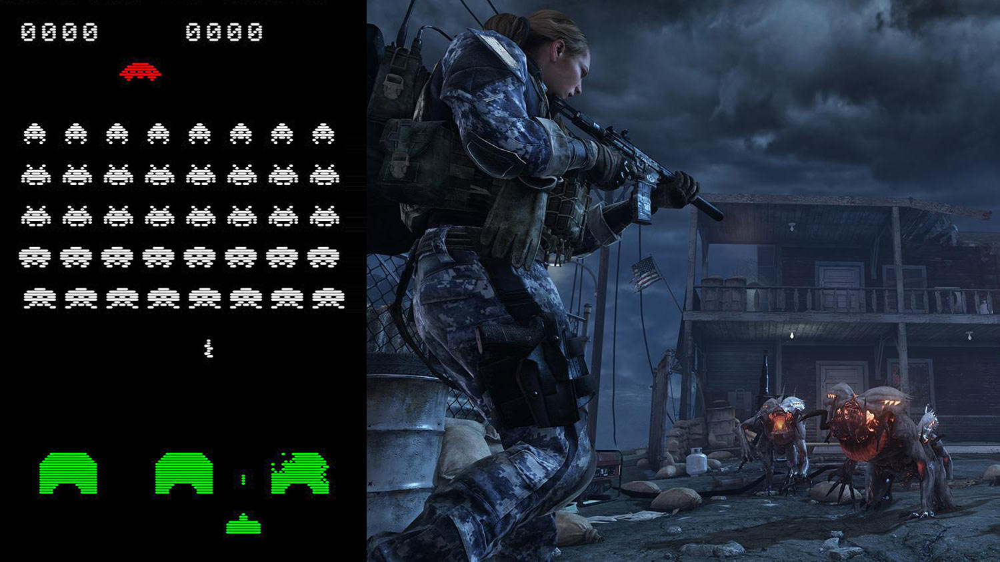
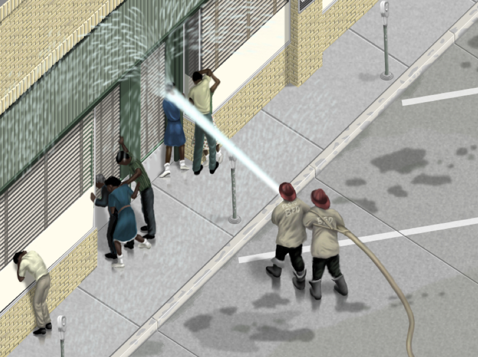
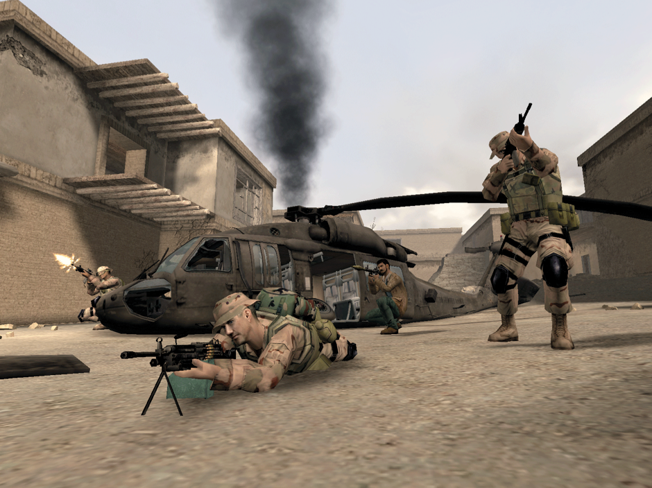
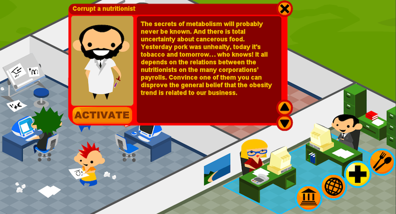
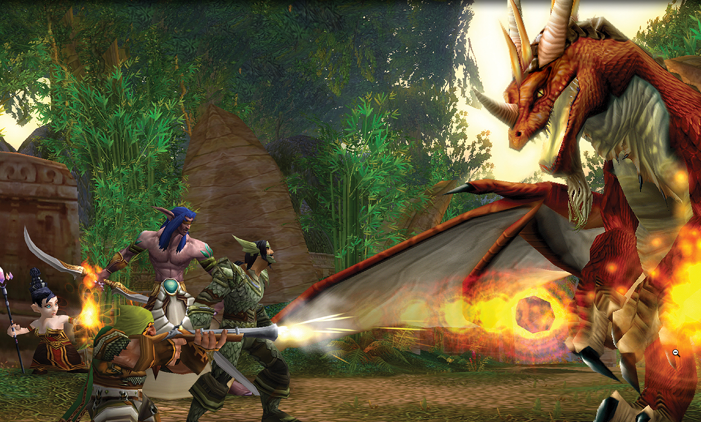
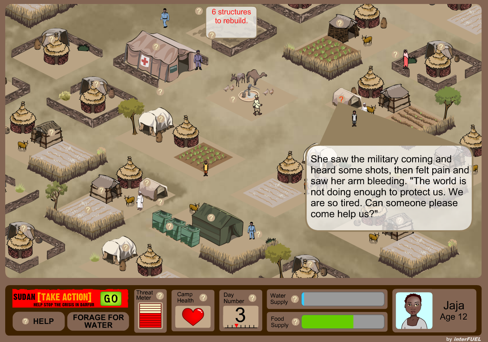

## Warnings!

### No experience? No problem.

You won't need any experience in game design or *coding* in this workshop: I will assume **zero knowledge**. 

In fact, you're probably more experienced *gamers* than myself.

# Verbs?

This session is about hacking games using a tool we are all familiar with: *verbs*! We're all familiar with verbs, right? 

> Ever tried to talk to a monster in a first-person-shooter, instead of shooting it? 

Whether it is running or collecting, shooting or trading, **games are driven by verbs**. 

Verbs determine what you can do in a game, how you can interact with its characters or other players, what you should do to win it, and what you simply can't do. 

#### Think of a game you've played recently. 

What actions does the game **let** you do? 

And what does the game **not let** you do?

# What the hack?

This workshop is about **designing games** with a hacker's mindset.

What does hacking mean to you? 

What does hacking mean [according to Google](https://www.google.co.uk/search?q=hacking&source=lnms&tbm=isch&sa=X&ei=CZguVeynIIOqafWlgLAK&ved=0CAcQ_AUoAQ&biw=1379&bih=782#q=hacking&tbas=0&tbm=isch&tbs=isz:l)?

Why does hacking have such **negative** connotation? 

Can we look at hacking as a **neutral**, or even **positive** practice? As in **modifying** something, possibly to **improve** it.

> Whatever code we hack, be it programming language, poetic language, math or music, curves or colourings, we create the possibility of new things entering the world. Not always great things, or even good things, but new things.

> [A Hacker Manifesto](http://subsol.c3.hu/subsol_2/contributors0/warktext.html) by Mackenzie Wark

#### A hacker practices creativity as **hacking the new out of the old**

# How do you *hack a game*?

Let's hack [rock-paper-scissors](http://en.wikipedia.org/wiki/Rock-paper-scissors).

Some ideas:

* **Add** or **remove** one element
* **Rename** the elements
* Change the **number of players** 
* Change the **rules** 
* Use the whole **body** 
* Use **noises** or **smells** 
* Is there a **strategy** to win this game?
* Change the **goal** of the game
* Turn it into a **collaborative** game

<!-- See http://www.protestgames.org/index.html#Peace, War, Revolution and http://www.deepfun.com/panther-person-porcupine -->

## What can you hack? 

One way to understand games is to analyse their **mechanics**, **dynamics** and **aesthetics**, aka the [MDA framework](assets/mda.pdf).

1. **Mechanics** are the *rules* of a game.
* **Dynamics** are what players tend to do in order to reach their game goals. 
* **Aesthetics** are what players experience and feel while playing.

For example, in *Chess* 

1. *Mechanics*: if your king is put into check, you are  forced the move it out of check
* *Dynamics*: you may start your game with pawns, then as the board clears, shift your focus on more powerful elements (there isn't a rule that forces you to do that, but you may have noticed it's a better strategy)
* *Aesthetics*: you play the role of a medieval commander, trying to outsmart your opponent in an open battle between two armies
 
**Mechanics shape dynamics, which in turn shape aesthetics.**

It's relatively easy to hack the aesthetics of a game (aka **re-skin** it) but that leaves the underlying mechanics and dynamics unchanged. It doesn't really make it a better or a different game.

We could argue that many contemporary videogames are re-skins of old arcade games, just with more sophisticated graphic and sound effects. For example most FPS (first-person shooter) games are still based on shooting and dodging mechanics, like [Space Invaders](http://en.wikipedia.org/wiki/Space_Invaders)). 

Here's where **verbs** can come in handy. They are connected to the very mechanics of a game. If you change the verbs of a game, it may look similar but will play very differently than the original.

# What will your game simulate?

A *simulation* is an abstraction of real life, which necessarily **leaves out** some of real life's complexities to focus on certain aspects only.

Which parts of real life do videogames generally leave out?

<!-- Do you find **racial tension** in SimCity? What about the American cities on which it was modelled? -->

<!--
In **military themed** first-person shooters you generally get a fantastical, propagandistic representation of war, reflecting a simplified vision of the world divided into goodies and baddies, where enemies are clearly distinguishable, dressed up with balaclavas, and civilians are nowhere to be seen.
-->

**What** system does [Farmville](http://en.wikipedia.org/wiki/FarmVille) simulate? **How** does it simulate business processes? 

Endless accumulation, endless expansion. But is that how things work in real life? 

Can you exclude the byproducts of industrial food production: pollution, deforestation, worsening labour conditions? 

On the other hand there's [McVideoGame](http://www.mcvideogame.com/index-eng.html), which simulates how the fast food giant operates:

* Your goal is to make money and avoid bankruptcy. 
* During the game you choose whether or not to feed the cows genetically altered grain, or plough over rainforests, or feed the cows to other cows. 
* You can also choose advertising strategies and public official corruption to counteract opponents of your actions.

# What roles will your players play?

Most mainstream games use roleplay in function of **escapism** and they tend to be *power fantasies*. 

Can you challenge players to experience the world from a different perspective? A **disempowered perspective**?

There are some experiments, like [Darfur is dying](http://www.darfurisdying.com) in which you play as a refugee, or [Spent](http://playspent.org), in which you experience daily life below the poverty line.

You can use awkward roleplay to create **moral dilemmas**, forcing the player into embarrassing, unusual roles. 

# Your turn

Form teams of 2-3 people.

You will receive two creative constraints:

1. An **issue** such as the financial crisis, climate change or digital literacy. See [all issues here](issues.md).
2. An arcade **game** such as Super Mario Bros, Pac-man or Space Invaders. See [all games here](games.md).

Head over to [**bit.ly/games-with-issues**](http://bit.ly/games-with-issues) to get your combo of issue and game!

### 1. Discuss the issue

Your first task is to discuss the issue and jot down **messages** you want to communicate and **behaviours** you want to promote.

* What do you want people to **know** about the issue?
* How do you want people to **feel** about the issue?
* What do you want people to **do** about the issue?
  
### 2. Analyse the game

Then you will **analyse the game by looking at its verbs**: what actions players can do, how they can interact with game characters or other players, what they should do to win the game, and what they simply can’t do. 

You will explore how these verbs express messages and morals (which *behaviours* they promote). 

### 3. Hack the game with the issue

Finally you will **redesign the game so that it is about the issue**, using a different set of verbs that reflect the messages and behaviours your team wants to promote. 

Focus on changing the *mechanics*, rather than *re-skinning* the game.

### Examples

#### Mario + food politics

Mario sets on a mission to collect and bring food to a hungry neighbourhood, whilst fighting Bowser, who controls a monopoly of restaurants and sends out Goombas to destroy the food.

#### Pac-Man + bullying  

Pac-Man is a student, bullied by ghosts. Some of them pick on his skin colour, others on his insatiable hunger. In order to defeat the different types of bullies, you needed different skills (fruits)

#### Space Invaders + international affairs

Space Invaders turns into a multiplayer game, using a Lemmings-like guidance mechanic to infiltrate the G20 meeting. You can play cooperatively or competitively.

#### Mario + economy

Princess Toadstool is in debt, and Mario has to bail her out. The more time passes, the bigger her debt grows.
So you set out to gather money and keep up with repayments, while the game keeps throwing moral dilemmas at you: mug people or burgle houses for quick bucks, or go the slower legitimate way of earning money with hard work? This idea sparkled from the thought that actions in the original Mario have no consequences, you keep jumping over turtles and breaking bricks, collecting coins that can't be traded.

#### Bomberman + digital literacy

You have Internet connection, but your friends don't. Your first goal is to get them connected, so that you can start building things together. So you set out to find cable and build a physical network, but the network thieves drop bombs to destroy your connections. When you connect another player, they can help you make the network stronger and unlock new challenges to build the Open Web.

#### Pac-man + energy

You (Pac-man) want to be energy efficient, but energy corporations want you to waste it. Your goal is to get out of each level's maze by consuming the least amount of energy (dots), while the shiny gadgets and juicy appliances that are thrown at you to increase your bill. This game subverts the Pac-man gameplay by turning its endless hunger and pointless accumulation into a strategic avoidance.